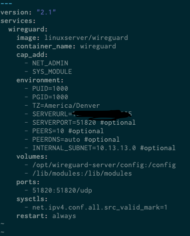

# The Goal 

It might be heplful to open this repo in the answering of the question, "why host your own VPN?" The answer is not quite as black and white as some would make it out to be.  There are those who would vehimetly say that to use any other VPN besides your own is just plain stupid, and there are those on the other extream who would say that hosting your own is risky and should be avoided.  

The answer lies in between.  For sure, self hosting is not for everyone.  Most won't need, or should host there own.  There is a level of technical complexity that comes along with it that may require some previous skills, expearience, or at the very least a willingness to learn.  
So who is self hosing for?:
  
- Those who want to know exactly is going on under the hood of their VPN
- Those who would like to use stricter protocols than their current VPN provider offers
- Those would would find a cost-to-time benifit of maintaining their own server
- Those would who like to doing super nerdy things on the weekend :)

Maybe my reasons for going this route will shed some light on the matter.  First, let me be clear that I do not subscribe to the belief that VPNs are the end all to internet security and privacy.  That belief is wrong and foolish.  VPNs do however offer an elememt of protection that I think is needed.  In the Cyber Security realm we call this "defense in depth", or "layered defense."  This is the idea that no one security procautin can completely protect us as there will always be holes that can be exploited.  That is why we layer defense.  Think of it like slices of swiss cheese.  Each slice has holes in it.  Any one slice is easily permiable.  However, when we stack layers on top of each other, each additional slice covers up some of the holes that the previous layer had.  If you stack enough layers, you will come to a point of reasonable inpermiabilitiy.  The same is true with privacy and security.  If you rely on any one layer to cover all the bases you will fall flat on your face.  Layer them and you will be more secure.  So, what do VPNs do?  

- they mask your IP so that websites see the VPN IP and not yours
- they offer and encrypted tunnel from the client to the VPN server
- They may help you work around Geoblocking
- In some rare cases your speeds may be improved, but most often they are slowed down

So how does this relate to my reasons for hosting my own VPN server?  Well, I wanted a VPN to give me the ability to not expose my home IP address to the internet.  Yes, my ISP knows where I live, and the IP assigned to my modem, but this adds a element of privacy, where I can hide it more than I could otherwise from the websites I visit.  And that mostly covers it.  I want to be able to browse the internet and have some kind of barrier between my traffic and what other sites can see.  If done right, you can use a VPN to circumvent your IPSs ability to know what sites you visit. I find that incredibly invasive.  Again, it is not some magic bullet, but it does help things a bit.  

With this goal in mind,  I went looking for a VPN.  I had a few stipulations.

1. I don't want to have to download a VPN app.  I want to be able to download a config file and import it into a VPN client, like WireGuard or OPVNP
2. It needs to use or at least support the WireGuard protocol
3. It needed to not log traffic
4. It needed to have a good reputation
5. It needed to have a real cost to benifit ratio
6. It needed to be able to be configured on a Network
7. I needed to be able to connect up to 10 devices without breaking the bank

The search was much more complicated that I had thought.  I had free accounts with the ProtonVPN, which I like, but the free account has some definite speed throttling.  In order the get the full benifits of ProtonVPN, I would need to fork out at least $100 per year, and to be able to connect the ammount of devices I needed to, the number was closer to $300.

Don't get me wrong, I love Proton.  I use their email service, and really like it.  I don't however want to fork the money, and why would I when I could deploy my own server for a fraction of the cost?

There were other providers out there that I looked at like, PIA, and Mullvade. Mullvad was very close to what I was looking for but the cost was the main draw back.  PIA...well, that is a whole other story.  Though there is not evidence at the writing of this to say they are in deep with the historically sketchy activities of Kape Technologies, I could not bring myself to take the risk.  

After all of this, I finally came to the point where I wanted to spin up my own server.  A this point, this was not something too extreme, or something I was not comfortable with.  I had already been getting ready to build and self host my own NextCloud server so this seemed like a good idea.  I like control.  Ok, who doesn't? All that said, by spinning up my own server, I could guerentee that, 

1. No logs were being kept
2. the cost would be low
3. I could use the WireGuard protocol
4. I would not have download a VPN providers app, and could just use a config file

With all these benifits, I jumped on it.  I was able to get a fairly beefy server for $49 a year.  


Looking at these specs, I know that if down the road I wanted to add some other service to my network I could easily deploy a docker image with that service without loosing any performace.Pacific Rack (the VPS provider) also had some other very fairly priced options.  This, this was too good an option to pass up.

But lets be real, there are some real draw backs to this method.

1. There is only one IP at your disposal. Meaning if you want to change "locations", you can't.  You will be tied to where every that server is.
2. You are responsible for making sure that the server is secure and locked down.  If you don't know how to do this, it could be a problem.  

Despite the extra resonsiblity, and only having one IP for me to use, I still think it is better than nothing.  And the extra transperrency and ability to control things tighter was a huge selling point.  

The goals then could be summed up with:

1. Have a VPN Server I control 
2. Have that VPN Server be cost effective
3. Take control of what goes on with my connection 
4. Have a VPN service that does not require me to download a providers app
5. Have a VPN that uses the WireGuard Protocol

I believe that with this VPN solution, I can achieve this goal with few drawbacks.  

# High Level Overview

Now lets discuss how this can all be accomplished.  This will be broken down into several sections:
1. choosing a VPS
2. choosing a protocol
3. choosing a deployment method
4. creating a repeatable, scalable, deployment solution
5. Connecting and distributing Peer configuations


## Choosing a VPS
this whole topic tends to be subjective in all reality.  There are so many choices out there with so many different offerings that at the end of the day, it really comes down to budget, needs/expectations, and location.  

Starting with *budget*, in my situation I wanted the server to cost me no more than $100.  With a little help from a friend who has been more in tune with the VPS space than I over the years, I was able to secure a VPS for $49 a year.  As seen above and below in the pictures, the specs to cost ratio seemed to be reasonable.  Since I live in the Western US, having a west coast server works out in my advantage.  


If you need more horse power, there will certainly be those option available, though if you are only planning on running a personal VPN on it, you won't need all that much.  Granted, that largly depends on how many clients you intend to connect, and how much traffic those clients will be pushing through.  In my use case, this option works more than sufficiently with enough resources left to host other services if I needed/wanted to.  

This brings us to the second consideration in choosing a VPS.  What do you expect and need from the sever?  If you need a 200 Mbps uplink, but only get a server with 100, then your connection will be throttled.  If you need the ability to run a VPN, and other services off the server, then you may want to consider a VPS with more juice to give you.  Because it was cheap enough, I went with more power and bandwidth than I needed at the time to give me the freedom to expand as needed down the road.  If you are tight on a budget, choose whichever option works best for you.  

Now lets talk location. If you live on the East Coast and choose a server on the West Coast, then your connection will be slower.  It is more than possible to make it work, and maybe this is the route you want to take, however, it is worth bearing in mind that the further away you are from where the VPS provider is, then the slower your connection will be.  If you want to have the option for both, then spin up multiple servers in different locations.  

As a bonus, lets talk payment method.  For some who may want that extra bit of privacy, and OPSEC, payment options could be a real draw back.  Ideally it would be great to pay with cash, or at least bit coin.  However, that may not always be possible.  Theorectically you could use a service like Privacy.com to pay for a service like this in a more private way, but even then its not guerenteed to work.  Whatever your needs, you will want to consider your options carefully.  
 

## Chosing a Protocol

There are many VPN protocols out there.  More than there is space to discuess the benifits and drawbacks of each.  This section is not intended to be a thourough breakdown of each one, but rather to just give a summery as to why I have chosen the one that I have.  

As mentioned above, I have chosen to go with the WireGuard protocol.  This is for a number of reasons.

1. WireGuard is a lightwieght protocol with only about 4,000 lines of code.
2. WireGuard has gained a lot of traction as being the new standard
3. WireGuard is open source
4. Wireguard has very good cryptographic practices.  (Check out their website for more info)

This is not to say that all of the rest of the protocols are junk an not worth using.  It is to say that WireGuard is very fast, and very efficient without sacrificing security, flexibility and usability along the way.  

You can chose whichever one you want.  OpenVPN is still a good option.  This repo however is geared towards building and deploying WireGuard VPNs.  

If you would like to learn more about WireGuard you can check out their website here: https://www.wireguard.com/

Additionally, if you are that kind of person and want to take a gander at the source code, you can take a look at their repo(s) here: https://www.wireguard.com/repositories/


## Chosing a Deployment Method

There are a few ways that you can deploy a VPN server.  The first method is the old school way of doing things where you spin up a server, and then start building on the host machine until you have what you are looking to achieve.  While this will work, technology has afforded us a much more efficient, scalable and repeatable method of deployment.  Enter Docker.  If you want a thourough look at Docker.io, I would recomend visiing the link provided.  In short, "A Docker container image is a lightweight, standalone, executable package of software that includes everything needed to run an application: code, runtime, system tools, system libraries and settings" (https://www.docker.com/resources/what-container).

In deploying our VPN this ways, we can consistently spin up lots of servers if needed, and then configure those servers in much the same way, cutting down on setup time and offering us a repeatable method of starting up a VPN server.  

In some use cases, docker.io will also allow us to manage multiple containers on a seperate machine, from what is sometimes called a "Jump-Box."  This allows us to push configuations to all our servers once from a single location, instead of having to go into each VPS and make configuration manually.  As my cyber-security instructor has said: "a good security engineer is a lazy one.  He make the computer to all the heavy lifting."  And so with docker, we can create an efficient and repeatable work flow that will allow us to mamage multiple instances.
With all these advantages we will be using this method.  

## Creating a Repeatable, Scalable, Deployment Solution

Docker.io already allows us to achieve a vast amount of this goal.  However, we can make it even more efficient through the use of bash scripts.  Throughout this deployment process we will be taking what we do to configure the server and turn it into a .sh file that can be curled on any server, run, and have it do 90% of the initial set up work.  You can see an example of how this might work with one of the Cloud Deployments I built: https://github.com/DavidHoenisch/Elk-Stack-Cloud-Deployment

Similar to that deployment, we will create a script that runs the set up for us.  This will cut our deployment time down drastically.  

You can find those scripts here: 


When I was intitially getting wiregurd up and running there were a few resources that I found especially helpful in figuring out how to make it all happen.  Much of what the script does is pulled from these sources.  All I did is compile them together to create a script that can be deployed.  Ther are other options out there.  Mine does not do anything special that the other don't.  I have aimed for simplicity so some features may be lacking that other scripts would provide.


## Connecting and Distributing Peer Configuations
Setting up peers on the new VPN connection is actually fairly simple. Mostly.  Tablets and phones are easiest as all that needs to be done is scanning a QR code.  In keeping with the goals of going this VPN route, we will not be building a custom VPN client, we will just use the WireGuard software package and a VPN config file.  The goal is to keep things as simple as possible.  Also, there is no need for a VPN provider to have apps on a client device.  The less connection the provider has with the client the better.  At least in my opinion. 

The setup script that we will be writing can help handle some of the distribution of the config files.  For personal use, using *SCP* is a great way to get the files from the remote server to a client machine.  Though if you could easily use copy and paste if the situation allows. 

# Building Out the Server

Now that we have gained a high level view of what it is we are tryig to accomplish, lets begin building out the server. 

Once you make a payment, you will get an email at the address you provided at check out that will have the login creds for your server.  This is a headless setup so some comfortability with the CLI will come in handy for you.  To log in:

```
$ ssh [login]@[ip_address]
```

Replace the login with the user name, in my case it was root, and the ip address part with the ip provided to you in the email.  When you run the command you will be prompted for a password.  This will be the password that was supplied in the same email.  If you have entered all the login info correctly, you will be dropped into a shell on the VPS.  


## Hardening the Server

Upon login in, there are some things that I would highly recommend doing.  For of all, we need to create a new user.  It is not good practice to use the root user primarily.  Instead, we will create an admin user and then invoke ` sudo ` when we need to run a command that requires root privs.

You can use either the ` useradd` or the ` adduser` to do this.  In my case, I used this:

```
$ adduser admin
```

this will walk you through several several steps of setup.  The notable difference here between `adduser` and `useradd` is that useradd will not set up a home directory for the new user.  Use whichever you want. 

Next, we need to change the password for the root user that we were given.  

```
$ passwd root
```

We can also do things like create password expiry dates if you want to add another layer of security.  

```
$ chage -M 90 [login]
```

In this example, we are setting the password to expire after 90 days.  Once the password expires the user will be force to create a new password.  

If you wanted to add warn days, you can use this:

```
$ chage -W 3 [login]
```

In this case we are setting the warnings range to 3 days before the password expires.  

Before moving on, open a new terminal window and ensure that you can login in.  If not, make the needed corrections until you are able to login from the `new` terminal window.

Another vital change we need to make is to disable root login.  Only do this after you have made sure that you can login under the new user.  If you don't verify this you risk getting locked out of your server.  To do this we need to edit a config file.  For ease of use this readers who may be newer to this we will use NANO, but VIM or some other text editor will work as will.  

```
$ nano /etc/ssh/sshd_config
```
When you run this command you will be dropped into a text file.  We are looking for the line that says `PermitRootLogin`

We need to make sure that is says `no` after this line.  When you are complete it should look something like this: `PermitRootLogin no`

Now we need to reload some services.
```
$ systemctl restart sshd
$ service sshd restart
$ /etc/init.d/ssh restart
```
Run each command line by line.  Once you have done so, the root user will not loger be able to login.  It is always a good idea to test this and make sure it works.  Exit the server and try using `ssh` to get in as root.  If you did everything right your connection will be refused.  

There are other hardening steps that could be made.  Those might include:
1. enabling SElinux
2. Setting up ssh key login
3. Setting up ufw or firewalld to only only traffic vital to the vpn service
4. changing the defualt ssh port

All of these options will add another layer to our defense in depth model.  For sake of space here, I recommend that you do the research on each of these and learn how to implement them into your server.


## Getting The Server Ready

With the users all taken care of its time to get to prepping the server.  First thing one should always do when spinning up a new server is make sure it is up to date.  I am running an Ubuntu 20.04 LTS server so we will be using the `apt` package manager. 

```
$ sudo apt update -y && sudo apt upgrade -y && sudo apt autoremove -y
```
Once you have finished the server will be up to date and we can move on to install the needed software.  

## Installing WireGuard And Needed Software

[ a great write up on this process acan be found here: https://www.the-digital-life.com/en/wireguard-docker/ I will yanking from his blog post :) ]

As stated above a bash script has been supplied in this repo for a more automated deployement process.  

The first thing we need to do is install the software needed to install packages over HTTP(TLS/SSL):  apt-transport-https, ca-certifcates, and gnupg-agent.

```
sudo apt-get install apt-transport-https ca-certificates curl gnupg-agent software-properties-common
```

Next we use curl to download the gpg key needed

```
curl -fsSL https://download.docker.com/linux/ubuntu/gpg | sudo apt-key add -
```
Now we will run a script that will allow us to easily install needed software that cannot be obtained in the Ubuntu repsoitory

```
sudo add-apt-repository "deb [arch=amd64] https://download.docker.com/linux/ubuntu $(lsb_release -cs) stable"
```

Now we will update the system again and then pull docker utilities

```
sudo apt-get update && sudo apt-get install docker-ce docker-ce-cli containerd.io
```
With the utilities installed we can now pull the image we want
```
sudo curl -L "https://github.com/docker/compose/releases/download/1.26.2/docker-compose-$(uname -s)-$(uname -m)" -o /usr/local/bin/docker-compose
```

Next we change the permissions to have the `x` bit
```
sudo chmod +x /usr/local/bin/docker-compose
```
Change the group
```
sudo usermod -aG docker $USER
```
Create a new group
```
newgrp docker
```

Alright, now time for the "nitty gritties"
First, we need to make a directory and change its owner.
```
sudo mkdir /opt/wireguard-server

sudo chown admin:admin /opt/wireguard-server
```
This next step requires getting your hands dirty, even if you are setting this up with the script.  We need to open the .yaml file and make sure that the configurations are the way that we want them.  I will be using vim, but any text editor will do.  

```
vim /opt/wireguard-server/docker-compose.yaml
```
once in the compose file, make sure that the script has the IP of your server, and the ports that you would like to use. 



In the place of SERVERURL put the IP address of your server. For the server port you can make them what you want, but 51820 is a safe option. Be sure that under the `ports` section that you follow the format in the picture.  Set the time zone accordingly.  I would make sure that the `restart` section is set to always. In the `peers` section under `enviroment` set the number to however many connection you would like to be available.  In the future if you need more you can increase this number and then force recreate the profiles.  Though keep in mind if you do this all old profiles you are currently using will no longer work.  Give your self a generous number for now.  

Once you are done with that, close out of your text editor.

With all the needed modifications needed we can now run the yaml file and it will deploy the main part of the VPN. 

```
docker-compose up -d
```

With this part done the VPN is running and it is just a matter of connecting clients to the network.  We will cover that in the next section.


## Connecting Clients

We will cover to two most common client connections, Mobile and Computer.  I will cover how to connect MacBooks, iPhones, iPads, Linux Laptops, Windows machines, and Android Phones.  Thankfully, for the most part they all follow the same general principles.  Mobile devices, (phones and tablets) are the easiest to get connected.  Computers require a little bit more work.  

### Mobile Devices.  
Lets start with the easiest.  To get connected we will need two things.  One, the WireGuard application and two, the .conf files from our server.  The Wireguard client is available for Download from both the Google Play store as well as the App Store.  And for those who are runnning custom ROMs on Android...well, you already know where to look :)


Additionally, you can find the app in the macOS app store.  

With the app downloaded, we need to generate a QR code so that we can connect to the server.  

In the server run the following command:
```
sudo apt install qrencode
```
this will download a package that will allow us to generate, or more specifically view the QR code in the terminal window.  

Next run:
```
qrencode -t ansiutf8 < [file.conf]
```
Be sure to replace the `[file.conf]` section with the peer info you want to view.  The format is simply `peer1`.  Replace the number one with whichever peer number you want to view.  You will need to run this command from inside the `/opt/wireguard-server/config` directory or provide the filepath before the peer name in the qrencode command.  

If the command was run correctly you should now have a QR code displayed on your screen.  

Now inside your phone you can click the + button in the upper right hand site of the screen.  Select create from QR code in the pop-up menu and then scan the code with your phone camera.  You should now be connected.  You may be prompted to provide a name for the connection.  You can call it whatever you want.  You will now control the VPN from inside the WireGuard application.  


The process will be the same for most if not all mobile devices.  


## macOS

For macOS you will need to download the WireGuard application and launch it.  You will get a new icon in the upper left tool bar that you can use to connect, disconnect and configure you VPN connection.  

To get this all set up we will need to transfer the config files from our server to our macbook. Or you can copt and paste. Doing this can be tricky depending on your computer and network settings.  For myself, I run fire walls on my computer and on my network.  Doing so meant that I had to make Firewall rules on my network firewall as well as set up port fowarding, and set the application firewall to let SSH traffic in from the server.  Depending on your setup, you may need to follow a different process for this.  You will for sure need to enable Remote Login though and set up port fowarding.  To do this, click on the Apple in the upper lefthand corner go to system preferences > sharing and enable `Remote Login`. 

With the Firewall provisions needed enabled, and Remote Login enabled, we should be good to make the transfer.  

In the server terminal window, 
```
$scp file.txt remote_username@10.10.0.2:/remote/directory

```
In the place of `remote_username` put your user name.  in the place of 10.10.0.2 put your IP address.  If you don't know what it is then you can use `curl ifconfig.me` in your host terminal to figure out what it is.  Be sure at the end of the command to supply the folder you would like the config folder to be put in.  Maybe something like /Desktop.  

Once you have all the correct info in the command run it.  You should be prompted with a message asking for your password.  Tpye it in and it will transer the file.  

On your host machine, click on the dragon icon in your tool bar.  The click `Manage Tunnels`.  Once there you will have the option to create a new tunnel.  Select the plus button in the bottom left hand corner and go to `import tunnel from file`.  


Once you do so you will be prompted to select the config file that you just downloaded.  Select the file and follow the on screen prompts.  

Once done you can Activate and Deactivate the VPN from the WireGuard client.  

## Linux 

The WireGuard deployment on Linux is a bit more involved.  I am currenly working on figuring out how to make it easier for most to get it working.  Once I have researched and built a good scripted solution I will add it to this section and to the scripts folder.

## Windows

Windows has a solution similar to macOS.  For this you will need to download the WireGuard software from WireGuards website (https://www.wireguard.com/install/).  

Once the file has downloaded, run it and follow all the on screen instructions.  When it has finished downloading, launch the program and select `add empty tunnel`. You will then be presented with a diaglogue box.  I have found that the easiest way way to set this up is to `cat` the peer.conf file on the server, and then copy and paste the contents over exacly.  Give the tunnel a name and then save it.  One you have activated the tunnel, you should be able to connected to the server.  To double check and make sure, launch `cmd` and run:
```
curl ifconfig.me
```

if the output returns the servers address then you are connected properly. 


## Some Final Notes

No matter what OS you are running I recommend running a DNS leak check just to be sure that your machines queries are not giving away your true IP.  I use this website: https://www.dnsleaktest.com/

If it returns you true *location* then you will need to do some tweaks on your network.  Use Google to figure out what may be causing that issue with your computer and your network setup.  

It is also a good Idea to make sure that you don't have an IPv6 leak.  You can do so here: https://ipv6leak.com/

  

 


